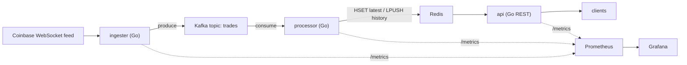

# crypto-market-pipeline

A real-time cryptocurrency **market-data pipeline**: Go microservices that ingest live
exchange ticks over WebSockets, stream them through **Kafka**, cache them in **Redis**, and
serve them over a **REST API** — containerized with **Docker**, orchestrated on **Kubernetes**
(local [kind] / **Azure AKS**), provisioned with **Terraform**, shipped via **GitHub Actions**
CI/CD, and instrumented with **Prometheus/Grafana**.



## Stack
Go · Apache Kafka · Redis · Docker · Kubernetes (kind / Azure AKS) · Terraform · GitHub Actions · Prometheus · Grafana

## Services
| Service     | Role                                                        | Ports |
|-------------|-------------------------------------------------------------|-------|
| `ingester`  | Coinbase WebSocket ticker → Kafka `trades`                  | 2112 (metrics) |
| `processor` | Kafka `trades` → Redis (latest hash + rolling history list) | 2112 (metrics) |
| `api`       | REST over Redis: latest prices                              | 8080 |

## Run locally
Prereqs: a Docker daemon (this repo uses [Colima](https://github.com/abiosoft/colima)) and Go 1.22+.

```bash
colima start            # start the Docker daemon (once)
make up                 # build images + start kafka, redis, ingester, processor, api
make logs               # watch it flow
curl -s localhost:8080/prices | jq .
curl -s localhost:8080/prices/BTC-USD | jq .
make down               # tear down
```

## API
| Method / path          | Description                       |
|------------------------|-----------------------------------|
| `GET /prices`          | Latest price for every symbol     |
| `GET /prices/{symbol}` | Latest price for one symbol       |
| `GET /healthz`         | Liveness probe                    |
| `GET /metrics`         | Prometheus metrics                |

## Kubernetes
Manifests live in [`deploy/k8s`](deploy/k8s). Local cluster via `kind`; cloud via **Azure AKS**
provisioned with Terraform in [`deploy/terraform`](deploy/terraform). _(Built out in phases — see repo history.)_

## CI/CD
GitHub Actions ([`.github/workflows`](.github/workflows)): `go test` → build images → push to
GitHub Container Registry (ghcr.io) → deploy to the cluster.

## Layout
```
cmd/{ingester,processor,api}   service entrypoints
internal/trade                 shared tick model
internal/obs                   config + Prometheus/health helpers
deploy/{docker-compose.yml,k8s,terraform}
```
