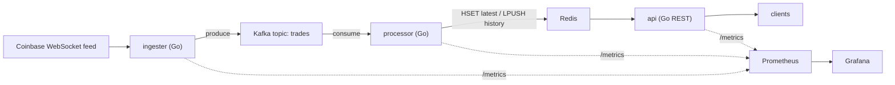

# crypto-market-pipeline

[](https://github.com/hirashif/crypto-market-pipeline/actions/workflows/ci.yml)

A real-time cryptocurrency **market-data pipeline**: Go microservices that ingest live
exchange ticks over WebSockets, stream them through **Kafka**, cache them in **Redis**, and
serve them over a **REST API**. Containerized with **Docker**, orchestrated on **Kubernetes**
(local kind / **Azure AKS**), provisioned with **Terraform**, shipped via **GitHub Actions**
CI/CD, and instrumented with **Prometheus/Grafana**.



## Why I built this
I got into crypto through a Bitcoin protocol class in college and I've been trading and following the markets since. Trading makes you care about market data quickly: you want live prices and recent history, and pulling them from someone else's dashboard gets old. So I built my own feed. It was also the excuse to learn the production streaming stack for real, Kafka for transport, Redis for hot reads, Kubernetes and Terraform to run it like a service instead of a script on my laptop. The history endpoint exists because that rolling window is the raw material for the signals I actually want to compute next.

## Stack
Go · Apache Kafka · Redis · Docker · Kubernetes (kind / Azure AKS) · Terraform · GitHub Actions · Prometheus · Grafana

## Services
| Service     | Role                                                        | Ports |
|-------------|-------------------------------------------------------------|-------|
| `ingester`  | Coinbase WebSocket ticker → Kafka `trades`                  | 2112 (metrics) |
| `processor` | Kafka `trades` → Redis (latest hash + rolling history list) | 2112 (metrics) |
| `api`       | REST over Redis: latest prices                              | 8080 |

## Run locally
Prereqs: a Docker daemon (this repo uses [Colima](https://github.com/abiosoft/colima)) and Go 1.22+.

```bash
colima start            # start the Docker daemon (once)
make up                 # build images + start kafka, redis, ingester, processor, api
make logs               # watch it flow
curl -s localhost:8080/prices | jq .
curl -s localhost:8080/prices/BTC-USD | jq .
make down               # tear down
```

## API
| Method / path                  | Description                              |
|--------------------------------|------------------------------------------|
| `GET /prices`                  | Latest price for every symbol            |
| `GET /prices/{symbol}`         | Latest price for one symbol              |
| `GET /prices/{symbol}/history` | Last 100 prices, most recent first       |
| `GET /healthz`                 | Liveness probe                           |
| `GET /metrics`                 | Prometheus metrics                       |

```bash
$ curl -s localhost:8080/prices/BTC-USD
{"symbol":"BTC-USD","price":106842.15,"time":"2026-07-14T19:04:11.512Z"}

$ curl -s localhost:8080/prices/BTC-USD/history
{"symbol":"BTC-USD","prices":[106842.15,106841.9,106839.77]}
```

## Kubernetes
Manifests live in [`deploy/k8s`](deploy/k8s). Local cluster via `kind`; cloud via **Azure AKS**
provisioned with Terraform in [`deploy/terraform`](deploy/terraform). _(built out in phases, see repo history)_

## CI/CD
GitHub Actions ([`.github/workflows`](.github/workflows)): `go test` → build images → push to
GitHub Container Registry (ghcr.io) → deploy to the cluster.

## Design notes
A few decisions worth calling out, and the tradeoffs behind them.

**Three services instead of one.** Ingesting from a websocket, writing to a datastore, and serving reads have different scaling and failure profiles, so they are split into `ingester`, `processor`, and `api` with Kafka as the buffer between ingest and processing. A burst of ticks or a slow consumer never backs up into the websocket read loop, and the read path shares nothing with the write path except Redis.

**Kafka keyed by symbol.** The ingester partitions on `product_id` (a hash balancer), so all ticks for a symbol land on the same partition and stay ordered. Ordering is per-symbol, which is all that matters for a price feed; there is no need for a global order across symbols.

**Redis data model.** The processor pipelines its writes per tick into one round trip:
- `price:<symbol>` (hash) holds the latest price and timestamp, overwritten each tick.
- `symbols` (set) tracks which symbols exist, so the api can list them without scanning keys.
- `history:<symbol>` (list) keeps the last 100 prices with `LPUSH` + `LTRIM`, a cheap rolling window that never grows unbounded.

**Delivery is at-least-once.** The processor reads with a Kafka consumer group and commits offsets after writing. On a crash and redelivery the latest-price hash is fine because `HSET` is idempotent, but the history list could pick up a duplicate. That is an acceptable tradeoff for a price feed; if it were not, I would dedup on a per-message sequence id.

**Built to scale sideways.** The ingester reconnects with backoff on any websocket or Kafka error. All three services expose Prometheus metrics and a `/healthz` endpoint (what the Kubernetes probes hit), and they are stateless, so they scale horizontally and restart cleanly. All state lives in Kafka and Redis.

## What I'd do next
- Run multiple ingesters (per exchange, or symbols sharded across instances) instead of a single websocket connection.
- Sink history to a time-series store (Timescale/ClickHouse) for real analytics; Redis only holds the hot window today.
- Add Redis replication and a multi-broker Kafka to remove the single points of failure in the demo setup.
- Add auth on the api (rate limiting is in).

## Layout
```
cmd/{ingester,processor,api}   service entrypoints
internal/trade                 shared tick model
internal/obs                   config + Prometheus/health helpers
deploy/{docker-compose.yml,k8s,terraform}
```
